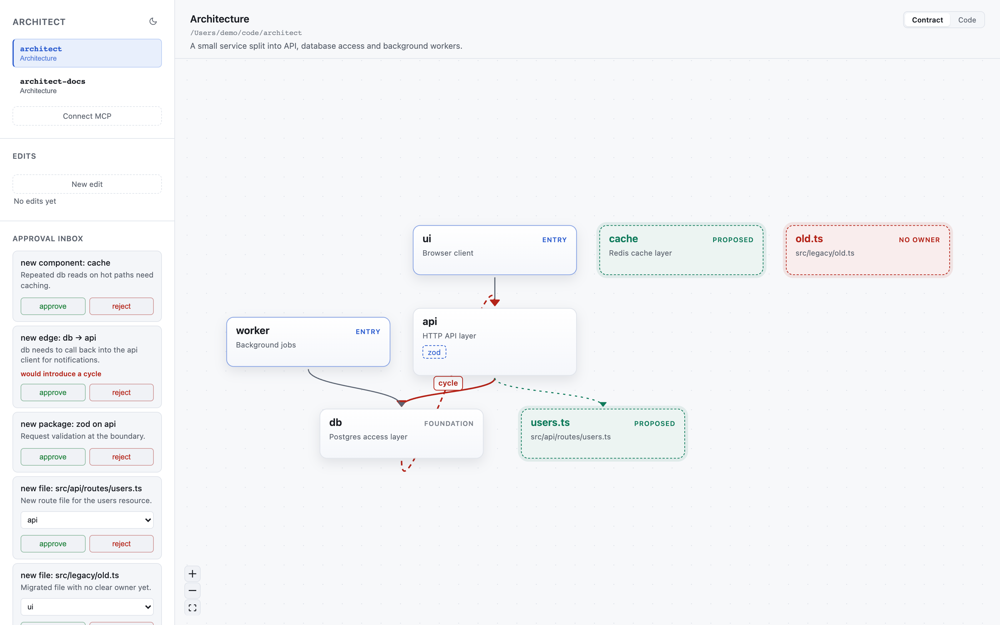
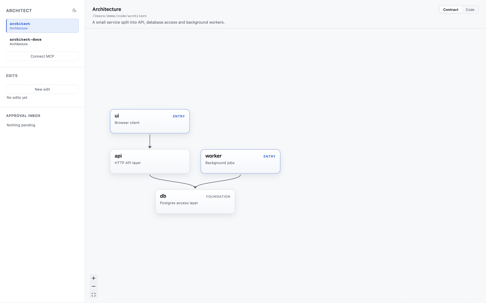
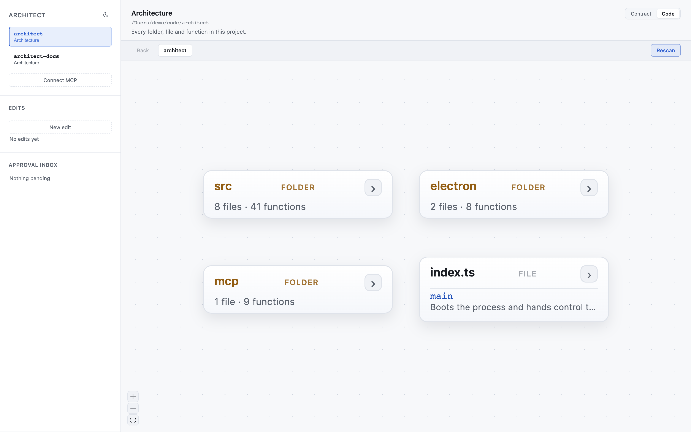
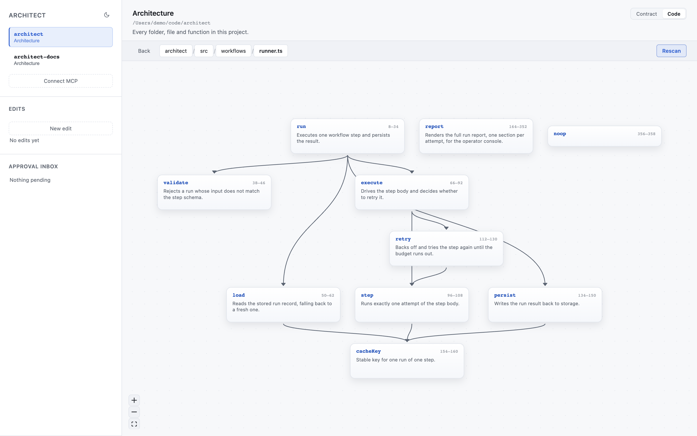
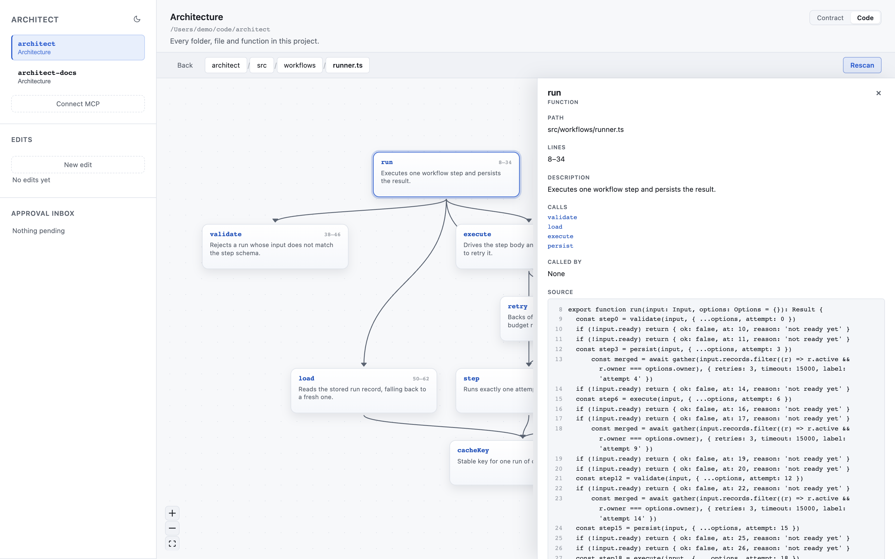

<div align="center">

# Architect

**Draw your architecture. Make your AI follow it.**

Coding agents generate structure faster than anyone reviews it. Architect puts the engineer back in control: you draw the system, the agent has to read it, and every structural change it wants comes back to you for approval on the canvas.

[](LICENSE)
[](https://modelcontextprotocol.io)

</div>

---

## What it looks like



*Five blocked calls waiting in the inbox, each one already drawn on the canvas as a dashed ghost. The `db -> api` edge would close a cycle, so the cycle lights up red.*



*The same project once the inbox is clear: the architecture as you drew it, reading top to bottom.*



*Code mode drops the contract and reads the repo as it actually is, folder by folder.*



*Descend into a file and its functions become the graph, with the calls between them as edges.*



*Pick a function to get its callers, its calls and its source without leaving the canvas.*

## The problem

Left alone, an agent invents a new service, a new util layer, a new dependency and a new folder nobody asked for. Each one is defensible on its own. Together they are how a clean codebase becomes unreviewable in a week.

Telling the agent "follow the architecture" in a prompt does not hold. Prompts are advice. Architect makes it a gate.

## How it works

You draw the architecture once, as boxes and arrows. Each box claims part of the repo with a glob, which is what turns a drawing into a contract.

Then the agent has to live inside it:

```
claude: check_change({ from: 'api', to: 'billing' })
        -> ALLOWED            the edge is drawn, answered instantly, you are not interrupted

claude: check_change({ from: 'ui', to: 'db' })
        -> FORBIDDEN          "the ui goes through api, it never touches the database directly"

claude: check_change({ from: 'api', to: 'search' })
        -> UNKNOWN-COMPONENT  'search' is not on the canvas, it proposes the component

claude: propose_change({ kind: 'component', id: 'search', ... })
        -> blocks

claude: check_change({ from: 'ui', to: 'billing' })
        -> UNDRAWN-EDGE       both components exist, no edge between them, it proposes the edge

claude: propose_change({ kind: 'edge', from: 'ui', to: 'billing', ... })
        -> blocks
```

At that moment a dashed ghost node appears on your canvas, sitting exactly where the new component would live, with its edges drawn in. If it would create a cycle, the cycle lights up red. You approve or reject in one click, and the blocked call returns.

**You never approve a text diff. You approve a picture of your system with the change in it.**

## What needs your approval

- **A new component.** The largest source of sprawl.
- **A new edge.** How a clean graph quietly becomes a mesh.
- **A new third party package.** The bloatware vector.
- **A file outside every glob.** Sprawl that never shows up as an import.

## The file

Everything lives in one `architect.md` at your repo root. It is readable with no tooling, diffs cleanly, and gets reviewed in a pull request like any other file. The prose above the fold is the whole contract: everything the tool enforces is spelled out in it.

```markdown
## Components

### api
HTTP layer, request validation, auth.
owns: `src/api/**`

## Dependencies

- api -> billing

## Forbidden

- ui -> db : the ui goes through api, it never touches the database directly
```

Node positions trail the document in an HTML comment, one `id: x,y` per line. They are a hint and nothing else. Anything the block cannot answer for, the graph lays out automatically, so deleting the block or garbling it costs you an arrangement and never a file.

```markdown
<!-- architect:layout
api: 320,40
billing: 320,220
-->
```

Architect ships with its own [`architect.md`](architect.md) describing Architect. It is the demo, the test fixture, and the proof the tool survives contact with itself.

## Install

Architect is an installed desktop app for macOS and Windows, not a browser tab, because it runs in your tray and has to answer the agent the moment it asks.

Until the first packaged release, build and install it from source:

```bash
npm install
npm run install:local
```

That installs the app and writes the MCP bridge to `~/.architect/bin/architect-mcp.mjs`, outside the app bundle, because Node cannot execute a file inside `app.asar`. If that file is missing, `npm run install:local` has not run yet and no client can reach Architect.

Register the bridge once, with whichever client you use.

Claude Code, in any terminal:

```bash
claude mcp add --scope user architect -- node ~/.architect/bin/architect-mcp.mjs
```

Claude Desktop, merged into `claude_desktop_config.json`, then restart it. Neither it nor Codex expands `~`, so write the absolute path:

```json
{
  "mcpServers": {
    "architect": {
      "command": "node",
      "args": ["/Users/you/.architect/bin/architect-mcp.mjs"]
    }
  }
}
```

Codex, appended to `~/.codex/config.toml`:

```toml
[mcp_servers.architect]
command = "node"
args = ["/Users/you/.architect/bin/architect-mcp.mjs"]
```

One registration covers every repo. The bridge sends its working directory with each call, and Architect walks up from there to find `architect.md`, so the right project resolves automatically. A repo with no `architect.md` gets a clear error rather than silently passing.

The app must be running for the bridge to reach it. It launches at login and lives in your tray.

## Editing architect.md

`npm run build` also produces a language server at `out/lsp/server.js`. Point any LSP client at it and `architect.md` gets diagnostics as you type, completion of component ids on dependency and forbidden lines, go to definition from an edge endpoint to the component that defines it, and rename across every reference including the layout hint.

The server speaks stdio and needs the `--stdio` flag:

```bash
node /path/to/architect/out/lsp/server.js --stdio
```

In Neovim that is `vim.lsp.start({ cmd = { 'node', '/path/to/architect/out/lsp/server.js', '--stdio' }, filetypes = { 'markdown' } })`. In VS Code it is the `serverOptions.command` of a `LanguageClient`. The server only answers for a document named `architect.md`, so pointing it at markdown in general is safe.

## Status

V1 is in active development. It is deliberately small:

**In:** the canvas, the four gated operations, ghost previews, cycle detection, multi project, and the four MCP tools that close the read plus approve loop.

**Out, on purpose:** no import verification yet, no drift report, no decision log, no cloud, no accounts. Those are V2, and they are tracked as issues.

## Contributing

Ideas are wanted, especially on the open design questions in the issues. See [CONTRIBUTING.md](CONTRIBUTING.md).

## License

Apache 2.0, copyright Abhiram Shaji. Contributions under DCO.
